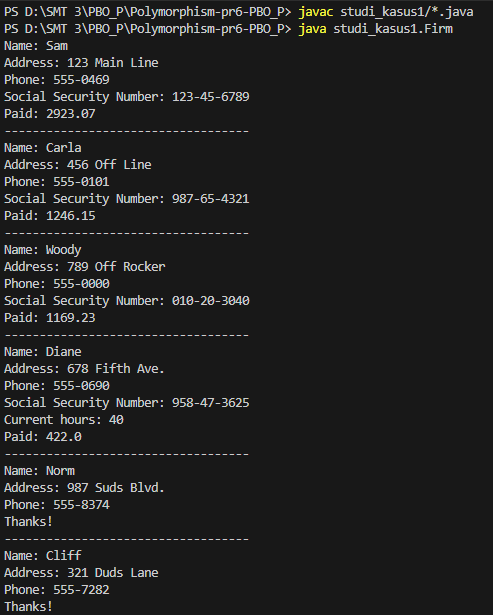
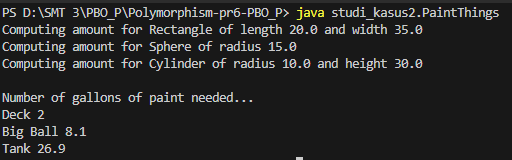
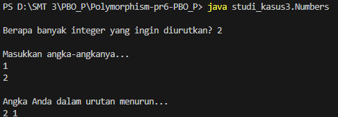

# Polymorphism & Sorting - Praktikum 6 PBO

Repositori ini berisi kode sumber Java untuk tugas **Praktikum 6: Polymorphism, Abstract Class, dan Interface**.

Proyek ini terdiri dari tiga studi kasus yang mendemonstrasikan konsep OOP tingkat lanjut:

1.  **Studi Kasus 1 (Employee System)**: Penerapan *Polymorphism* melalui pewarisan kelas `StaffMember` ke berbagai tipe karyawan (`Volunteer`, `Employee`, `Executive`, `Hourly`, `Commission`).
2.  **Studi Kasus 2 (Paint Things)**: Menggunakan *Abstract Class* `Shape` dan menghitung kebutuhan cat untuk berbagai bentuk geometri (`Sphere`, `Rectangle`, `Cylinder`).
3.  **Studi Kasus 3 (Sorting & Comparable)**: Implementasi *Interface* `Comparable` untuk mengurutkan angka, string, dan objek `Salesperson` menggunakan algoritma *Insertion Sort*.

## 📂 Daftar Program & Screenshot

### 1. Studi Kasus 1: Firm & Staff
Program manajemen gaji karyawan yang menunjukkan bagaimana metode `pay()` bekerja secara polimorfik (berbeda untuk setiap tipe karyawan).
> **Output:**
> 

### 2. Studi Kasus 2: Paint Calculator
Menghitung jumlah cat yang diperlukan untuk mengecat Deck (Persegi Panjang), Big Ball (Bola), dan Tank (Silinder).
> **Output:**
> 

### 3. Studi Kasus 3: Custom Sorting
Program ini mendemonstrasikan pengurutan data secara *descending* (menurun):
* **Numbers**: Mengurutkan array Integer.
* **Strings**: Mengurutkan array String.
* **WeeklySales**: Mengurutkan objek Salesperson berdasarkan total penjualan (dan nama jika penjualan sama).
> **Output:**
> 

---

## 🚀 Cara Menjalankan (PENTING!)

Kode dalam proyek ini menggunakan struktur **Package** (`package studi_kasus1`, dst). Oleh karena itu, kamu **WAJIB** menjalankan perintah dari **Folder Utama** (`Polymorphism-pr6-PBO_P`), jangan masuk ke dalam folder studi kasusnya.

1.  **Buka Terminal** di dalam folder `Polymorphism-pr6-PBO_P`.
2.  **Compile dan Run** menggunakan perintah berikut:

| Studi Kasus | File Utama | Perintah Compile | Perintah Run |
| :--- | :--- | :--- | :--- |
| **Kasus 1** | `Firm` | `javac studi_kasus1/*.java` | `java studi_kasus1.Firm` |
| **Kasus 2** | `PaintThings` | `javac studi_kasus2/*.java` | `java studi_kasus2.PaintThings` |
| **Kasus 3a** | `Numbers` | `javac studi_kasus3/*.java` | `java studi_kasus3.Numbers` |
| **Kasus 3b** | `Strings` | *(sudah ter-compile di atas)* | `java studi_kasus3.Strings` |
| **Kasus 3c** | `WeeklySales`| *(sudah ter-compile di atas)* | `java studi_kasus3.WeeklySales` |

> **Catatan:** Jika kamu menjalankan `java Firm` dari dalam folder `studi_kasus1`, program akan **ERROR**. Pastikan run dari luar folder paket dengan format `java namapaket.NamaKelas`.

---

## 👤 Identitas Pengirim

- **Nama** : Qlio Amanda Febriany
- **NIM** : 241511087
- **Kelas** : 2C
- **Prodi** : D3 Teknik Informatika